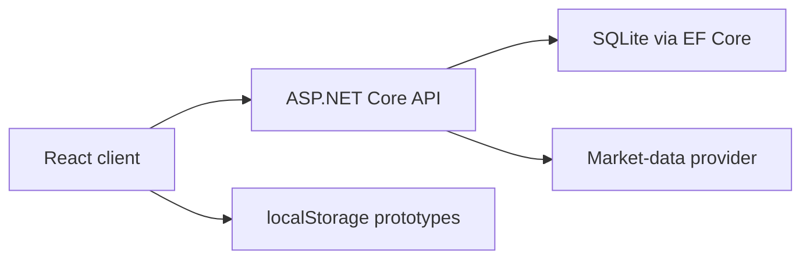

# WinWigApp

Full-stack academic project for simulating stock-market portfolio management. The application combines a React interface with an ASP.NET Core API, JWT authentication, Entity Framework Core and SQLite.

> Educational software only. It does not execute real trades or process real payments. Market values used by the main WIG20 interface are demonstration data.

## Project status

| Area | Status | Implementation |
| --- | --- | --- |
| Registration and login | Integrated | React forms, ASP.NET API, BCrypt password hashing, JWT |
| Wallet | Integrated | Balance, simulated deposits and deposit history stored in SQLite |
| Stock catalogue | Implemented with sample data | Search, filtering and sorting for a WIG20 data snapshot |
| Stock analysis | API-backed simulation | Generated OHLCV data with RSI, MACD, SMA50 and SMA200 calculations |
| Trading and portfolio | Client-side prototype | Buy/sell simulation, positions and stop-loss values stored in `localStorage` |
| Transaction history | Client-side prototype | Local transaction log with CSV export |
| Strategies | Client-side prototype | Create, edit and activate rule-based strategies in `localStorage` |
| External market-data endpoint | Experimental | Yahoo Finance integration for selected US tickers |

The backend already contains domain models for users, stocks, portfolios, transactions, deposits and strategies. Full API persistence for trading, portfolio positions and strategies remains on the roadmap.

## Why this project matters

The project demonstrates both software delivery and business-analysis work:

- translating user stories and acceptance criteria into application features,
- separating the React client from the ASP.NET Core API,
- modelling relational entities and relationships with EF Core,
- securing selected endpoints with JWT,
- implementing validation and basic financial calculations,
- documenting the current implementation honestly against the planned scope.

The original Polish requirements and acceptance criteria are available in [`docs/requirements-pl.md`](docs/requirements-pl.md). API integration notes are available in [`docs/api-integration-pl.md`](docs/api-integration-pl.md).

## Technology stack

### Frontend

- React 18 and TypeScript
- Vite
- React Router
- Tailwind CSS
- Recharts
- Radix UI components

### Backend

- ASP.NET Core 9
- Entity Framework Core
- SQLite
- JWT Bearer authentication
- BCrypt password hashing
- CsvHelper

## Architecture



The API currently persists authentication and wallet data. Trading, portfolio and strategy workflows remain client-side prototypes and are clearly separated from the integrated functionality.

## Repository structure

```text
WinWigApp/
|-- winwigapp.client/       React and TypeScript client
|-- WinWigApp.Server/       ASP.NET Core API
|-- docs/                   Requirements and API documentation
|-- WinWigApp.sln           Visual Studio solution
`-- README.md
```

## Local setup

### Requirements

- .NET 9 SDK
- Node.js 20 or newer
- npm

### 1. Install frontend dependencies

```bash
cd winwigapp.client
npm ci
```

### 2. Configure the local JWT secret

The repository intentionally does not contain a JWT signing secret.

PowerShell:

```powershell
$env:Jwt__Secret = "replace-with-a-local-development-key-at-least-32-characters"
```

Bash:

```bash
export Jwt__Secret="replace-with-a-local-development-key-at-least-32-characters"
```

### 3. Start the application

From the repository root:

```bash
dotnet run --project WinWigApp.Server --launch-profile https
```

The ASP.NET SPA proxy starts the Vite development server. The client is available at `http://localhost:5173`, while the API listens on `https://localhost:7054` and `http://localhost:5262`.

The SQLite database is generated locally on first start and is excluded from version control.

## Build

Frontend:

```bash
cd winwigapp.client
npm run build
```

Backend:

```bash
dotnet build WinWigApp.Server/WinWigApp.Server.csproj
```

## Roadmap

- persist buy/sell transactions through the API,
- persist portfolio positions and investment strategies,
- replace demonstration WIG20 values with a consistent market-data source,
- add automated backend and frontend tests,
- add portfolio-level performance and risk metrics,
- add application screenshots and a hosted demo.

## Academic context

Developed in 2026 as an academic project during the MSc in Informatics and Econometrics at AGH University of Krakow. The interface was initially prototyped with Figma Make and then combined with a custom ASP.NET Core backend.
